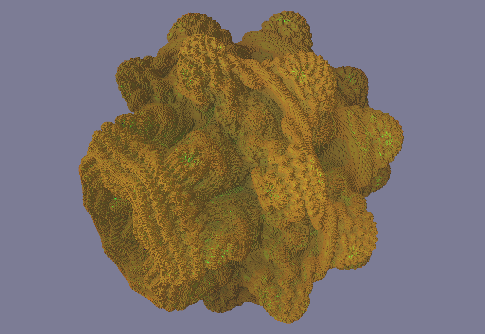
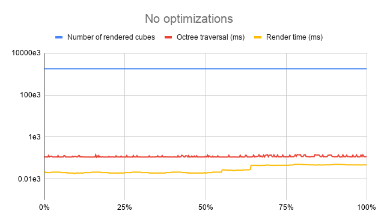
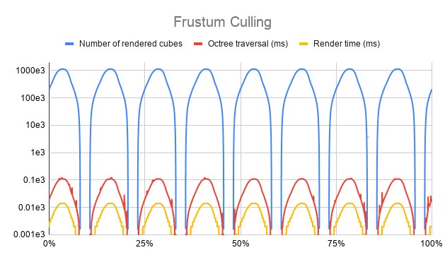
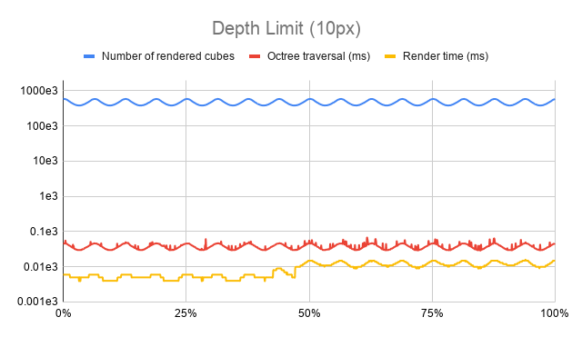
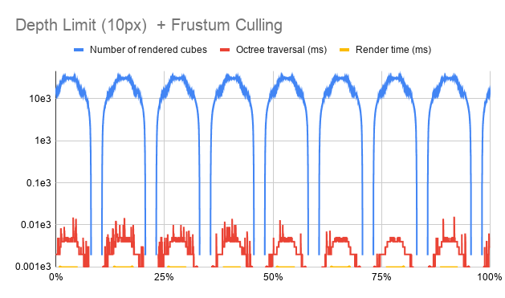
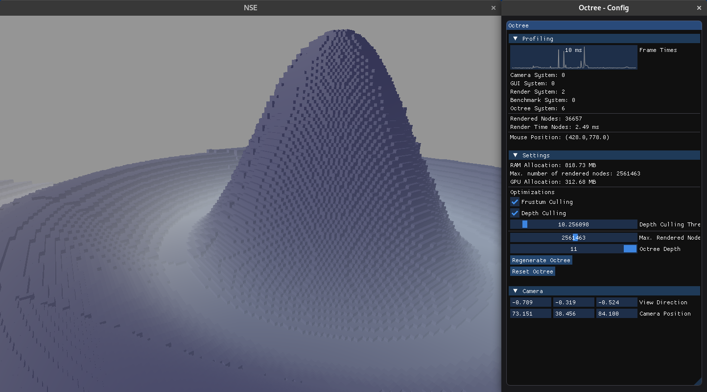
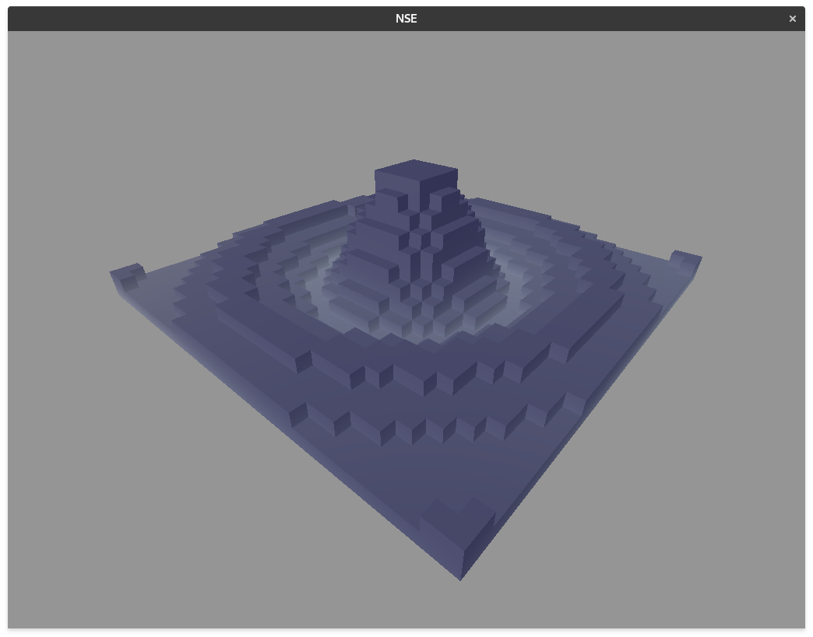

## Voxel Engine Optimizations

## Introduction

This document summarizes the implementation and findings of a rendering project that was conducted during the studies at the TU Wien.

The goal of this project was to develop a naive implementation of a simple voxel engine based on octrees and to implement two simple optimizations and to measure their effectiveness.

The fundamental problem with voxel engines is the amount of voxels can be tremendous if a high resolution is required.

The implemented optimizations consist of frustum culling and depth limitation (LOD).

Frustum culling prevents traversal and rendering of nodes outside the camera frustum and the depth limitation stops the traversal of nodes that are smaller than an approximated final pixel size.

## Implementation Overview

The engine is designed with a rudimentary Entity Component System (ECS).

This architecture builds on the concept of composition instead of inheritance and results in good extensibility and allows efficient data oriented programming.

Every object in the scene is an entity that is basically an empty container and aggregates components. The effective meaning of an entity is derived from the composition of components.

For example, the camera has at least a camera component and a transformation component.

Components only represent data and do not provide functionality. The transformation component, for example, contains position, rotation, and scale of objects.

Finally, systems manipulate the components of entities and normally work only on a subset of the entities that are identified by their specific component composition.

Systems can be implemented by users of the engine and added to the runtime.

The engine runtime then simply invokes all registered systems.

Adding an entity to the scene works basically as follows. 

1. Create an empty entity.
2. Create and add the required components to the entity.
3. Add the entity to the runtime.

The engine runtime manages the registration of entities and systems and provides a simple communication mechanism for the systems.

Every system can generate messages with arbitrary payloads. The messages are then collected by the runtime and broadcasted to all systems at the beginning of the next frame.

### Rendering

Rendering is handled by a system that works on entities that represent visible objects (e.g. meshes), and cameras. The actual rendering is implemented with the low level and unsafe rust library gfx-hal, which is modeled closely after Vulkan specification.

The necessary information is extracted from the components and used to record the command buffers. Furthermore, objects that share visible properties and can be rendered are identified and rendered with instancing if possible.

Octree entities are handled separately by the renderer since the octree component references a buffer on the GPU where the model matrices of all nodes that have to be rendered in the current frame are stored. 

### Octree

The octree system works with entities that contain an octree component and handles the configuration, the generation of the model matrices for the rendered cubes, and implements the optimizations. The octree itself is a simple data structure on the heap which can be accessed via the octree component. The actual tree is generated only to a specified depth and represents the surface of a radial sinc function.

### GUI

The GUI is a separate system that listens to multiple messages that should be displayed and emits messages when interactions, like disabling optimizations, happen.

The rendering of the GUI is separated from the 3D viewport and implemented with imgui-rs, a Rust wrapper around the C++ library imgui and a compatible OpenGL renderer. 

### Benchmarking

Benchmarking is handled by an additional system that performs a simple benchmark and records performance information of every frame.

After the benchmark is finished, the information is written to a CSV file, to work with the data in other tools.

## Evaluation

The benchmark moves the camera along a circular path around the peak of the radial sinc function for 8 periods in 60 seconds to capture a wide variety of viewing conditions.

The benchmark is separated into four stages. All stages use the same octree configuration but different optimization configurations.

The scene is rendered in a resolution of 1024x768 which currently is uncommonly small however this has not really an effect on the results since the implementation is clearly CPU limited and the renderer would rather be geometry limited than fill rasterization limited due to the fact that all nodes are rendered as complete cubes and no geometry optimizations are implemented.

### Benchmark Hardware

- **OS:** Arch Linux (kernel version 5.5.19)
- **RAM:** 24GB @ 3200Hz
- **CPU:** i5-6600K (Overclocked @ 4.30GHz)
- **GPU:** GeForce GTX 960

### Octree Configuration

The octree is generated to a depth of 10. This is equivalent to 8^10 (ca. 1.07E9) nodes. The maximum number of nodes that can be rendered is set to 4 million which is more than enough since the implementation is severely CPU limited.

### Benchmark Stage Configurations

The stages are configured with the four possible configurations of the frustum culling and depth limit implementation. This allows us to analyze the effect of the different optimizations alone and in combination. All stages use the same octree.

**Stages:**

*   No optimizations
*   Frustum culling
*   Depth limit
*   Frustum culling & depth limit

### Results 

The results of the stages are depicted in the images below as graphs over the complete benchmark duration. Note that the graphs show information with different units (number of nodes and milliseconds). Comparing the graphs reveals the optimization factor of the implementation.

The first stage traverses the complete octree and always renders the maximum number of allowed nodes. This results in a frame time in the order of 1 second.

Comparing this to the two graphs of only the frustum culling and only the depth limitation shows for both optimizations a performance improvement of a factor of exactly 10. The number of rendered nodes is about 1 million and the framerate is in the order of 0.1 seconds.

Furthermore, the frustum culling graph shows clearly the effect of looking away from the octree since the number of rendered nodes drops to 0 twice every period.

The waves that can be observed in the depth limit graph show the fact that the node size is projected to the camera plane and without frustum culling also the effect of this optimization is symmetric to the camera plane. In the case of the utilized scene this results in the largest number of nodes when the camera plane cuts through the level. This effect is phase shifted to the effects of frustum culling by 90 degrees.

Finally, the combination of both optimizations is depicted in the last graph. The most interesting part is that this graph reveals a performance improvement of 100 in comparison to no optimizations at all. This shows that the optimizations have no overlapping effect and that their combination can be considered very effective. The frametime drops to the order of 0.01 seconds (100 fps) and therefore can be considered real time.

## Possible Further Optimizations

The available optimizations are implemented naively and further rather obvious optimizations could alleviate the performance to another order of magnitude.

### Memory Layout

Enhancing the memory layout of the octree for faster and more cache efficient traversal. No profiling of the cache efficiency was done, but due to the pointer structure of the octree it is plausible to assume that a lot of performance is lost due to the huge number of indirections and cache misses. There might be alternative octree representations that significantly increase the performance of the octree traversal.

### Parallel Octree Evaluation

Traversing the octree is done on a single core and therefore does not utilize the possibilities of parallelization on modern hardware. Using a fiber or task library to evaluate parts of the octree in parallel could increase the performance further. One approach would be to create a task for every subtree of a specific size (e.g 8^4).

### GPU Compute Implementation

Evaluation of the tree on the CPU has the fundamental disadvantage that the information of the visible nodes has to be pushed to the GPU every frame and therefore requires a good portion of CPU-GPU bandwidth and additional synchronization.

A better approach would be to move the complete visibility computation to the GPU. This would probably be the largest performance improvement since it basically incorporates both of the previously mentioned optimizations. It would be necessary to implement an efficient data stream of the octree data to the GPU since VRAM typically is smaller than the system memory and large octrees would not fit on the GPU. However, this is also true for the CPU implementations where large octrees would have to be streamed from the persistent storage. Rust serialization libraries like “serde” would accelerate the development of such implementations and reduce the effort required.

### Reducing Geometry Overhead

The scene used in this work represents only a surface and not a Volume. If a volume is present, the number of nodes can be significantly larger. In this case it would be a good idea to stop traversal of nodes that contain no holes and to implement some kind of occlusion culling to prevent traversal of invisible nodes.

Currently a complete cube is rendered for every node. If the visible nodes are known it would be possible to reduce the geometry that has to be processed by the GPU even further by only rendering the visible faces of the cubes.

## Conclusion

The evaluation of the implemented optimizations shows their effectiveness clearly. Both optimizations, frustum culling and depth limitation, reduce the complexity by a factor of 10. They do not overlap and can, therefore, be combined to achieve a complexity reduction of a factor of 100. 

All in all, these optimizations alone allow real time applications with huge octrees and reasonable quality despite the naive implementation in this project.

## Screenshots

Screenshot of the rendered scene and the configuration window.

Screenshot of the scene with a depth of 5 and no optimizations.

Screenshot of the scene with a depth of 11 with frustum culling and depth limit of 20 pixel (~1ms frametime).

")

Screenshot of the scene with a depth of 11 with frustum culling and depth limit of 10 pixel (~3ms frametime).

")

Screenshot of the scene with a depth of 11 with frustum culling and depth limit of 5 pixel (~7ms frametime).

")

Screenshot of a scene close up with a depth of 11 with frustum culling and depth limit of 5 pixel (~20ms frametime).

.")
