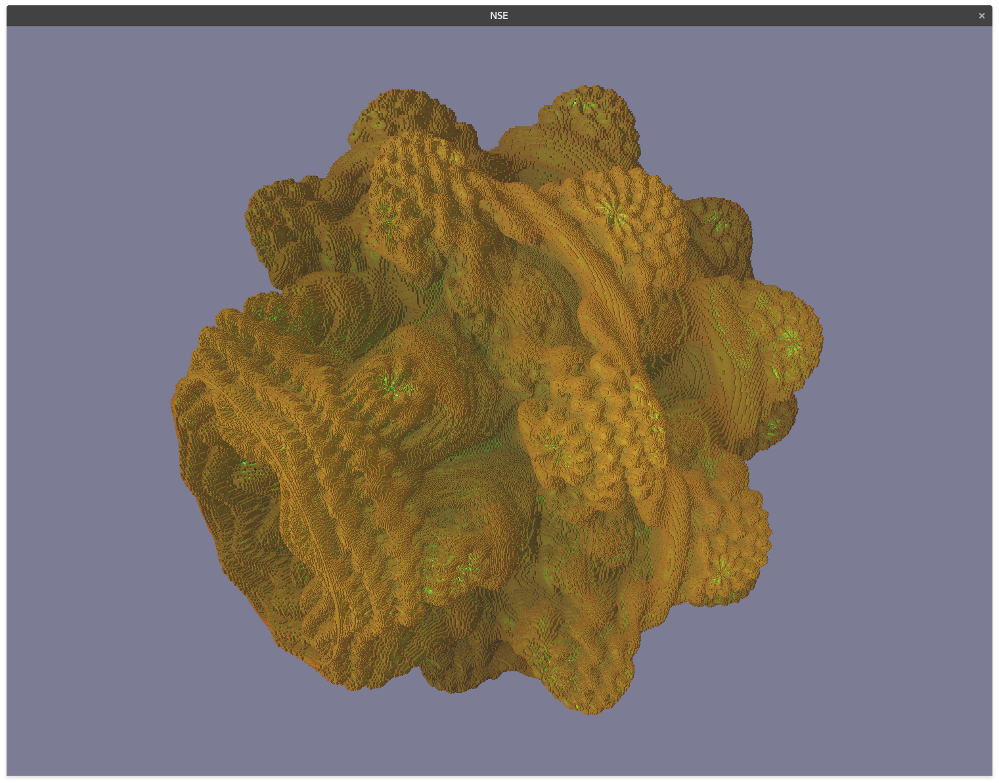
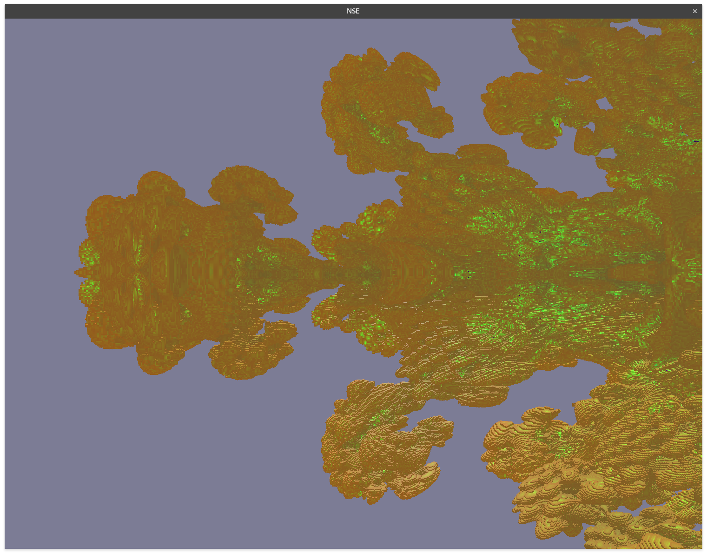
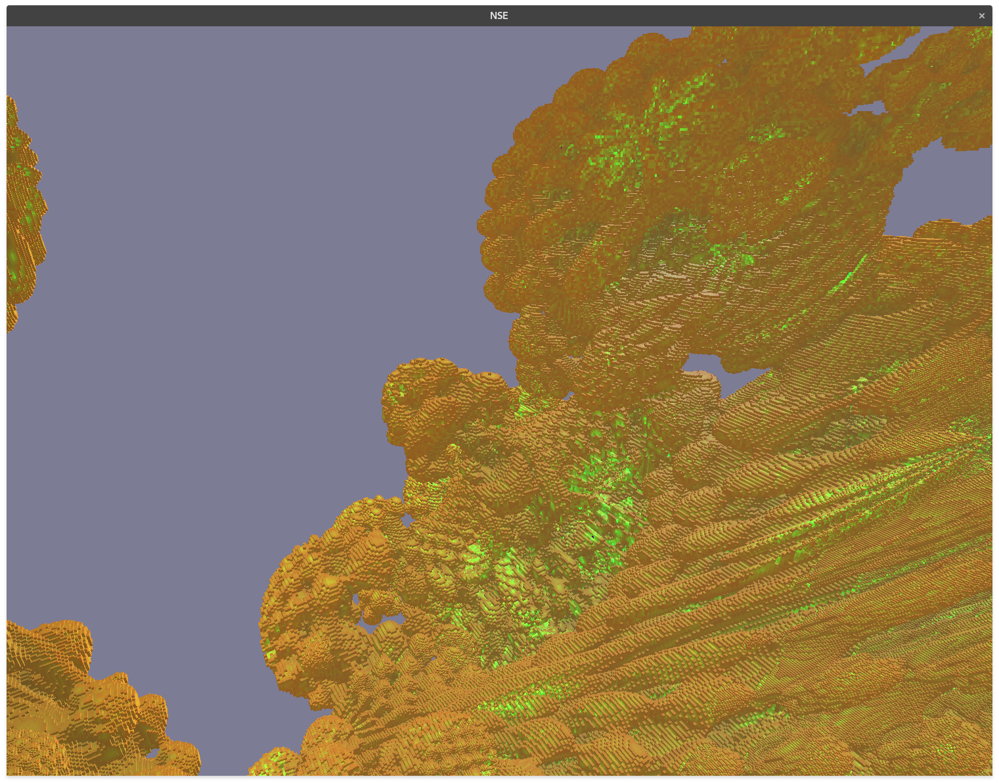
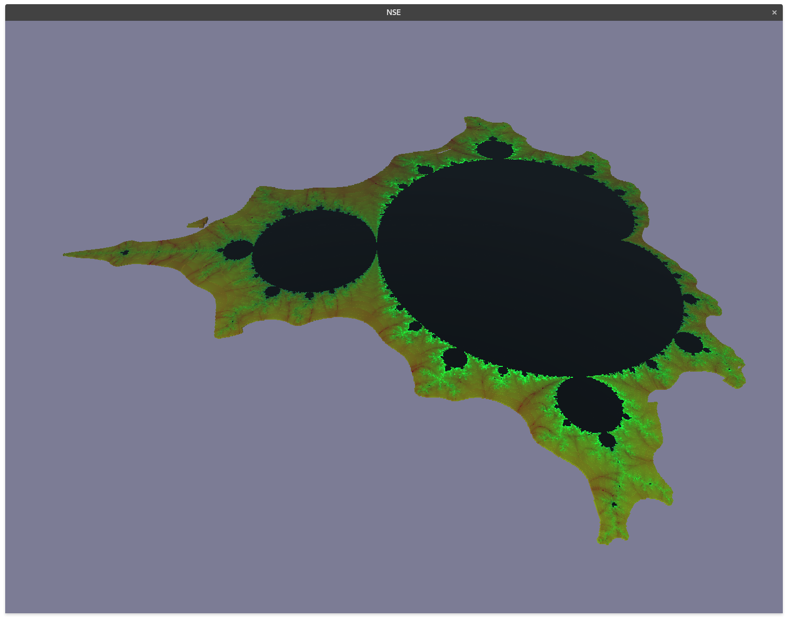
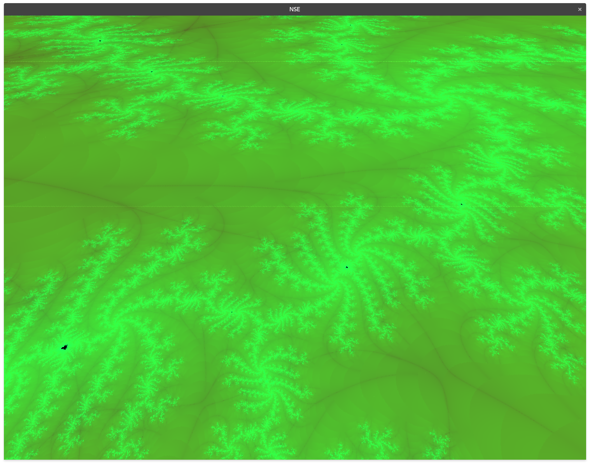
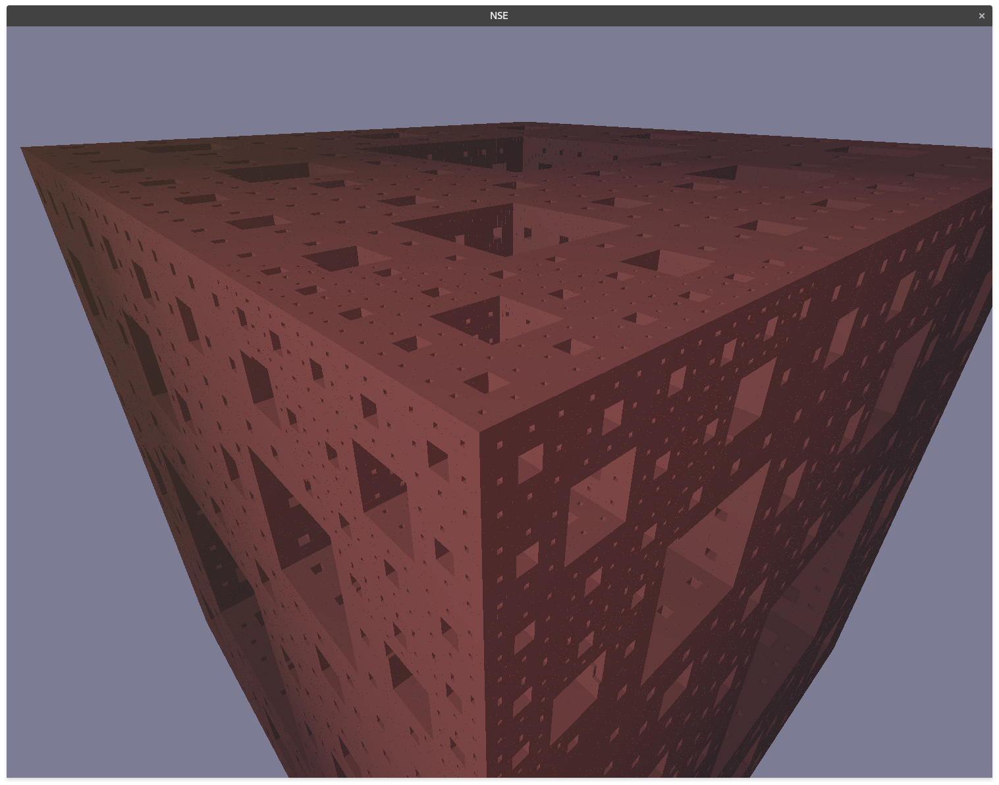
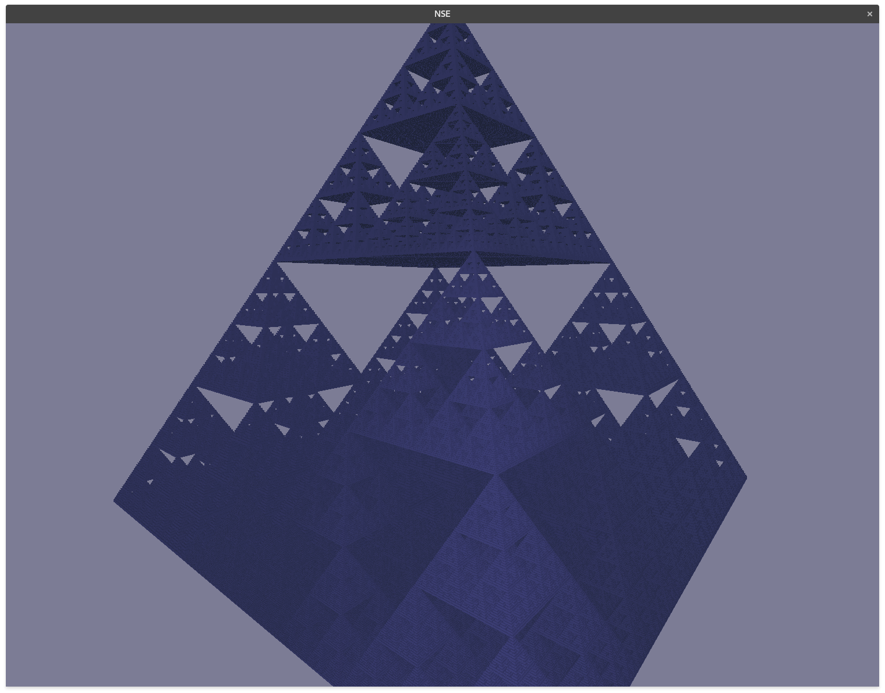
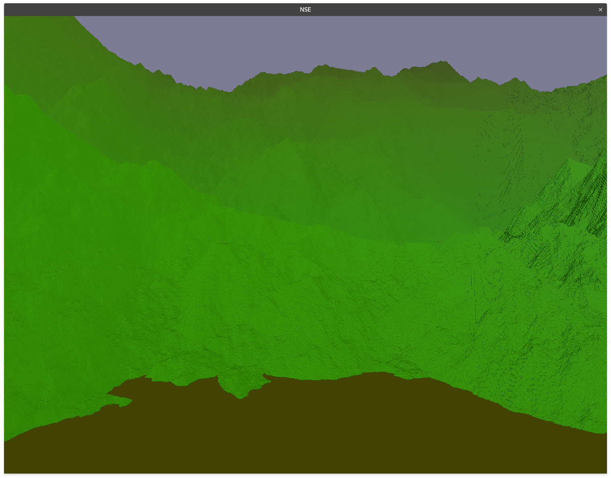

## Voxel Engine Optimizations

## Introduction

This document summarizes a project that was conducted during the studies at the TU Wien.
The goal of this project was to develop a simple fractal renderer with an octree as fundamental optimization structure.
This project is based on a previous work found [here](https://github.com/ifl0w/VEO-Rust).
The main challenge of this project was generating a selection of fractals in the octree data structure efficiently and the implementation of further optimizations, such as concurrent octree generation and rendering.

## Running the Example

You need to install the development tools for Rust and Vulkan for your platform in order to build the example.
Use the following command build and execute the fractal example in release mode.

``cargo run --release --example fractals --features vulkan``

## GUI and Usage
**Disclaimer** The performance depends heavily on the settings since every block is rendered as a single cube 
(no surface extraction is done). Hence, you should limit the number of rendered blocks if the performance degrades.

The gui displays profiling information, settings for the rendering, and the camera position and orientation.

The most important part are the settings.
In the first dropdown the rendered fractal can be selected.

The update button forces a new traversal of the octree and extension of the leave nodes where necessary.
If "continuous update" is selected, then such an update is triggered after any camera movement.

The next three sliders can be used to tune the performance.
* **Distance Threshold:** How large a block should approximately appear on the screen.
* **Distance Scale:** How fast the "Distance Threshold" decreases with distance from the camera.
* **Rendered Nodes:** Maximum number of nodes that are rendered on the GPU. 

## Fractal Selection

### Mandel Brot
Distance estimation

### Mandel Bulb
Distance estimation

### Menger Sponge
IFS

### Sierpinsky Pyramid/Tetrahedron
IFS

### Midpoint Displacement Terrain
Originally, I planned on implementing the diamond and squares algorithm, but it turned out to be not easily possible in the existing structure and probably is difficult to implement efficiently for octrees in general.
Diamond and squares requires the neighbourhood information, which is difficult to get by in an octree.
To find a neighbour, it is possible to start the tree traversal from the beginning or to store references to the neighbours in every node.
Both solutions are difficult in the current implementation. 
Especially since the nodes are generated concurrently and not in any particular order.

However, a simpler approach inspired by the simpler midpoint displacement did work, but the expected visual artifacts (creases along the node seems) from this approach do not look very appealing.

## Additional Optimizations

## Conclusion

The evaluation of the implemented optimizations shows their effectiveness.
Both optimizations, frustum culling and depth limitation, reduce the complexity by a factor of 10.
The performance improvements do not overlap and can, therefore, be combined to achieve a complexity reduction of a factor of 100.
All in all, these optimizations alone allow real time applications with huge octrees and reasonable quality despite the naive implementation in this project.

## Screenshots

Some screenshot of the rendered fractals.

