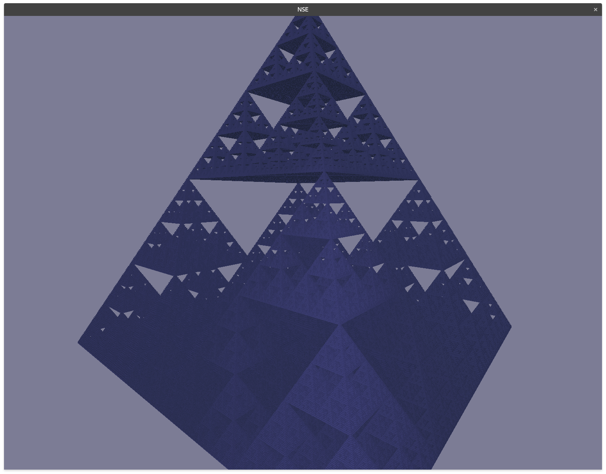

## Voxel Fractals

## Introduction

This document summarizes a project that was conducted during the studies at the TU Wien.
The goal was to develop a simple fractal renderer with an octree as the fundamental data structure.
The code is based on previous work from a simple voxel render engine written in Rust.
The original Repository can be found [here](https://github.com/ifl0w/VEO-Rust).

The main challenge of the project was to generate a selection of different fractals in an octree data structure efficiently.
Furthermore, additional optimizations had to be implemented to achieve better performance. The most substantial optimizations consist of concurrent octree generation and the usage of an arena allocator for faster memory allocation and deallocation.

## Running the Example

Install the development tools for Rust and Vulkan for your platform to build the example.
The following command builds and executes the fractal example in release mode.

``cargo run --release --example fractals``

## Controls

The camera is controlled with the following controls.

| Input        | Description                  |
|------------- |----------------------------  |
| Drag & Drop  | Rotate Camera                |
| W            | Move forward                |
| A            | Move left                    |
| S            | Move backward               |
| D            | Move right                   |
| Shift        | Sprint (10x movement speed)  |
| Scroll Down  | Decrease movement speed      |
| Scroll Up    | Increase movement speed      |

## Settings GUI

The GUI is displayed in a separate window and shows profiling information, rendering settings, and the camera position and orientation. This window is opened on start and can be reopened with ``F12´´ if closed.

The most important part is the settings panel.
In the first dropdown, the fractal can be selected.

The update button forces a new traversal of the octree and extension of the leave nodes where necessary.
If "Continuous Update" is selected, then such an update is triggered after any camera movement.

The following three sliders can be used to tune the performance and visual quality.
* **Distance Threshold:** How large a block should approximately appear on the screen.
* **Distance Scale:** How fast the "Distance Threshold" decreases with distance from the camera.
* **Rendered Nodes:** Maximum number of nodes that are rendered on the GPU. Random parts of the octree are not rendered if this limit is reached.

Finally, the reset button resets the three sliders and triggers a new update of the octree.
A new terrain is also generated, in the case of the fractal terrain.

**IMPORTANT** The performance depends heavily on the number of rendered nodes since every block is rendered as a single cube
(no surface extraction is done). Hence, you should limit the number of rendered blocks if the performance degrades.

## Fractals

**NOTE:** The implementation of the fractal generators can be found in `src/rendering/fractal_generators`.

### Mandel Bulb
A distance estimator is used for estimating the distance of every node to the surface of the Mandel Bulb.
The octree will only be refined if the bounding sphere of the node intersects with the surface of the fractal.

The number of iterations calculated depends on the depth of the node in the tree.
Hence, the calculation of a new node becomes more expensive with decreasing distance to the surface.
Also, the number of blocks to render becomes larger very fast with decreasing distance.
This is simply due to the infinite "roughness" of the surface, which results in more occlusion.
The "Distance Scale" setting can be decreased to limit the resulting performance degradation.

The color is assigned based on the number of iterations to reach the escape radius, the distance estimation, and the depth of the tree.
Unfortunately, it is sometimes difficult to make out the details of the surface due to missing shadows and occlusion effects (e.g., Screen Space Occlusion) in the renderer.

### Mandel Brot
The Mandel Brot is generated as a single slice (flat plane) and is not three-dimensional.
Every node performs an outer distance estimation for its center point.
The iteration number depends on the depth of the octree, and nodes that perform all iterations without reaching the escape radius are considered to lie inside the border of the fractal and are colored black.
The number of iterations and the distance estimator provide the color for nodes outside the border.

### Menger Sponge
The Menger Sponge is generated with an iterated function system (IFS).
For every node, the bounding box of the octree is transformed multiple times with the necessary functions.
After every iteration, the resulting bounding box is tested for an Intersection with the node's bounding box.
If it does intersect with the node, then the node will be subdivided.
Otherwise, the space is confirmed to be empty.

The main problem with the Menger Sponge is that it is subdivided into three parts along every axis, and the octree uses a subdivision of two.
This leads to more overlaps than necessary in comparison to if a subdivision of three was used for the tree.
Hence, a rather deep octree is required for the Menger Sponge to look good.

### Sierpinski Pyramid/Tetrahedron
The Sierpinski Pyramid and Tetrahedron are generated identically to the Menger Sponge.
They only use a different set of functions for the IFS.

### Midpoint Displacement Terrain
Initially, an implementation of the Diamond and Squares algorithm was planned.
Unfortunately, it turned out to be not directly possible in the existing structure and probably is challenging to implement efficiently for octrees in general.
Diamond and Squares requires neighborhood information, which is hard to get in an octree.
The tree can be traversed from the beginning to find neighbors, or references to neighbors have to be stored in every node.
Both solutions are complicated in the current implementation, especially since the nodes are generated concurrently and not in a particular order.

A simpler approach inspired by midpoint displacement did work, but some expected visual artifacts from this approach are visible.
Every node has four height values.
These values are averaged and displaced by a random value.
The corresponding values are propagated from the parent to the children.
In order to ensure that nodes on top of each other calculate the same height values, the node's position in the XZ plane (Y is up) is used as a seed for the PRNG.
This allows for terrains without holes or other significantly incorrect artifacts.
However, two artifacts remain.
First, if the random offset displaces the height value above or below a node, it is impossible to refine the neighboring node if it has already stopped subdividing.
Perfectly flat regions which may look like lakes are the result of this problem.
Second, since the random height values of the neighboring nodes are not taken into account, and the values on the seams of the nodes are not displaced, there are some pronounced creases along these seams where only linear interpolation is applied.
Hence, all mountains and valleys look a bit like pyramids.

## Conclusion

The implementation presents concurrent generation methods for various fractal classes in an octree data structure and direct rendering with traditional real-time methods.
On one side, the IFS and Distance Estimation Methods can be implemented easily.
On the other side, the terrain presents an example where more investigation is necessary for a visually plausible result.
Furthermore, the implementation would benefit from more optimizations like generation of the octree on the GPU (higher parallelism), surface extraction, and additional rendering effects like ambient occlusion and shadows.
Unfortunately, these extensions would huge changes to the render engine.

## Screenshots

### Mandel Bulb

### Mandel Brot

### Menger Sponge & Sierpinsky Pyramid

### Terrain

